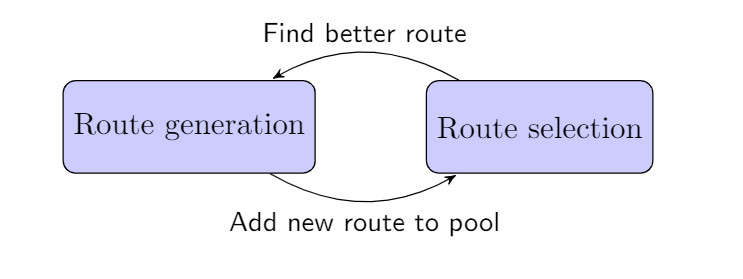

# Introduction

The Vehicle Routing Problem (VRP) is amongst the most well known combinatorial optimization problems. The most classical version of the VRP, the Capacitated VRP (CVRP) [@laporte2007you], can be described as follows. A fleet of vehicles with uniform capacity must serve customers with known demand for a single commodity.
The vehicles start and end their routes at a common depot and each customer must be served by exactly one vehicle.
The objective is to assign a sequence of customers to each vehicle of the fleet (a route), minimizing the total distance traveled, such that all customers are served and the total demand served by each vehicle does not exceed its capacity. Note that the VRP generalises the well-known traveling salesman problem (TSP) and is therefore computationally intractable.

Mathematicians have started tackling VRPs since 1959 [@dantzig1959truck]. Ever since, algorithms and computational power have not stopped improving. State of the art techniques include column generation approaches  [@costa2019exact; bramel1997solving] on which ``vrpy`` relies; more details are given hereafter.

``vrpy`` is of interest to the operational research community and others (e.g., logisticians, supply chain analysts) who wish to solve vehicle routing problems, and therefore has many obvious applications in industry.

# Features

``vrpy`` is a Python package that allows one to solve variants of the VRP including:

-   the Capacitated VRP (CVRP) [@laporte2007you;@baldacci2010exact],
-   the CVRP with resource constraints [@laporte1985optimal],
-   the CVRP with time windows  [@cordeau2000vrp],
-   the CVRP with simultaneous distribution and collection [@dell2006branch],
-   the CVRP with pickups and deliveries [@desrosiers1988shortest],
-   the CVRP with heterogeneous fleet [@choi2007column].

For each of these variants, it is possible to i/ set initial routes for the search (if one already has a solution at hand and wishes to improve it) ii/ lock routes (if part of the solution is imposed and must not be optimized) iii/ drop nodes (ignore a customer at the cost of a penalty).

``vrpy`` is built upon the well known *NetworkX* library [@hagberg2008exploring] and thus benefits of a user friendly API.

# Mathematical background

``vrpy`` solves vehicle routing problems with a column generation approach. The term *column generation* refers to the fact that iteratively, routes (or columns) are generated with a pricing problem, and fed to a master problem which selects the best routes among a pool such that each vertex is serviced exactly once. Results from the master problem are then used to search for new potential routes likely to improve the solution's cost, and so forth. This procedure is illustrated in Figure 1 below:

|  |
| :------------------------------: |
|  *Figure 1: Column Generation*   |

The master problem is a set partitioning linear formulation and is solved with the open source solver Clp from COIN-OR [@johnjforrest_2020_clp], while the subproblem is a shortest elementary path problem with *resource constraints*. It is solved with the help of the  ``cspy`` library [@cspy] which is specifically designed for such problems.

This column generation procedure is very generic, as for each of the featuring VRP variants, the master problem is identical and partitions the customers into subsets (routes). It is the subproblem (or pricing problem) that differs from one variant to another. More specifically, each variant has its unique set of *resources* which must remain in a given interval. For example, for the CVRP, a resource representing the vehicle's load is carried along the path and must not exceed the vehicle capacity; for the CVRP with time windows, two extra resources must be considered: the first one for time, and the second one for time window feasibility.

The flexibility and genericity of ``vrpy`` is strongly due to the power of column generation, and the relevance of ``cspy``.

# Advanced Features

For more advanced users, there are different pricing strategies (approaches for solving subproblems)
and some pre-pricing heuristics available that can lead to faster solutions.
The pricing strategies include: sparsification strategies [@dell2006branch] and [@santini2018branch]
and increasing k/-shortest path.
The heuristics implemented include: a greedy randomized heuristic
(for the CVRP and the CVRP with resource constraints) [@santini2018branch].

# References
